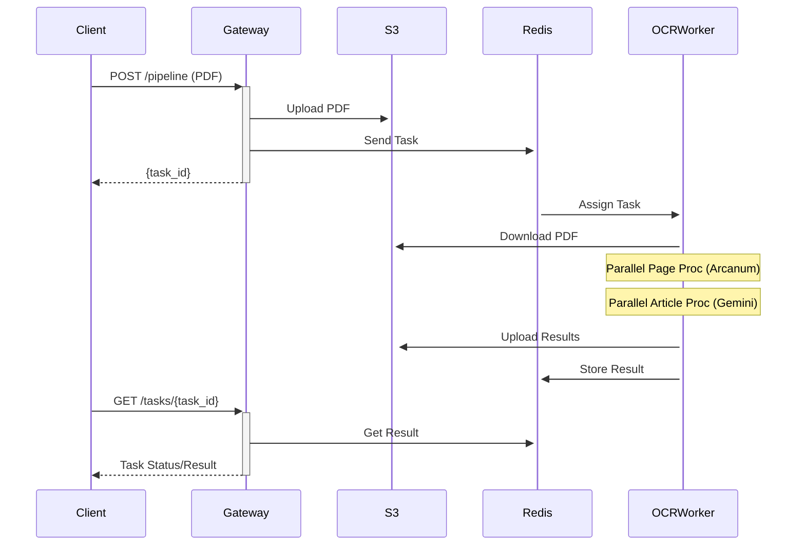

# Newspaper OCR & Content Analysis Pipeline

High-performance, scalable pipeline for processing scanned newspaper PDFs. Extracts articles, analyzes content using Google Gemini AI (OCR, translation, summary, sentiment, ministry identification), filters ads, and uploads results to AWS S3. Uses FastAPI for API and Celery with Redis for distributed, asynchronous task processing.

## Key Features

*   **Efficient PDF Processing:** Converts PDFs to images, leveraging Arcanum for newspaper segmentation.
*   **AI-Powered Content Analysis (Google Gemini):**
    *   Full OCR, language detection, and English translation.
    *   Date extraction, summarization, and sentiment analysis.
    *   Identifies relevant Indian government ministries.
*   **Multi-Level Parallelism & Optimization:**
    *   **Celery Workers:** Multiple worker processes handle different PDFs concurrently, each with a dedicated Gemini API key.
    *   **Page-Level Parallelism:** `asyncio` for concurrent segmentation of pages within a single PDF.
    *   **Article-Level Parallelism:** `asyncio` for concurrent Gemini analysis and S3 uploads of articles from a single PDF.
    *   **Arcanum Ad Pre-filtering:** Reduces load on Gemini by filtering ads based on segmentation labels.
    *   Configurable DPI and image quality for performance tuning.
*   **Asynchronous & Scalable:** FastAPI gateway with Celery workers for robust, non-blocking request handling.
*   **S3 Integration:** Stores all processed outputs (article images, JSON analysis) on AWS S3.
*   **Task Monitoring:** API endpoint for task status; compatible with Flower.

## Performance Gains

Significant speed improvements achieved through parallel processing and optimizations:

| PDF Pages | Old Time          | New Time         | Improvement |
| :-------- | :---------------- | :--------------- | :---------- |
| 1 Page    | ~52s              | **~20-25s**      | **~2x+**    |
| 12 Pages  | ~170s (2.8m)      | **~52s**         | **~3.2x**   |
| 18 Pages  | ~7.2m             | **~90-98s**      | **~4.4x+**  |
| 24 Pages  | ~12m              | **~124s (2m)**   | **~5.8x**   |

## Architecture

FastAPI gateway receives PDF uploads, stores them on S3, and dispatches processing tasks to Celery workers via Redis. Workers download PDFs from S3, perform multi-stage parallel processing (PDF conversion, Arcanum segmentation, Gemini analysis), and upload results to S3.



## Project Structure

```
.
├── .env
├── docker-compose.yml
├── gateway/              # FastAPI API
└── ocr_engine/           # Celery workers & processing logic
    ├── pipeline_logic.py # Core orchestration
    ├── tasks.py          # Celery tasks
    ├── celery_app.py     # Celery app setup
    ├── config.py         # Configurations
    ├── services/         # Processing modules
    └── ...
```

## Setup & Running

**Prerequisites:** Docker, Docker Compose, AWS S3 access, Google Gemini API Key(s), Arcanum Segmentation API Key.

**1. Environment Variables (`.env`):**
Create `.env` in project root:
```env
REDIS_URL=redis://redis:6379/0
AWS_S3_BUCKET_NAME=your-s3-bucket
AWS_S3_REGION=your-region
AWS_ACCESS_KEY_ID=your-access-key
AWS_SECRET_ACCESS_KEY=your-secret-key
GEMINI_API_KEY_1=your-gemini-key-1
# GEMINI_API_KEY_2=... (up to 4)
NEWSPAPER_SEGMENTATION_API_KEY=your-arcanum-key
# Optional: FLOWER_USER=admin, FLOWER_PASS=pass
```

**2. Build & Run with Docker Compose:**
```bash
docker-compose build
docker-compose up -d
```
*   **API Gateway:** `http://localhost:8000`
*   **Flower Monitor:** `http://localhost:5555`

**3. Send Processing Request:**
`POST http://localhost:8000/pipeline` with `form-data`:
*   `pdf`: (file) The newspaper PDF.
*   `publicationName`: (string)
*   `editionName`: (string)
*   `languageName`: (string)
*   `date`: (string, optional) `dd-mm-yyyy`
*   `dpi`: (int, optional, default: 150)
*   `quality`: (int, optional, default: 85)

**Example `curl`:**
```bash
curl -X POST "http://localhost:8000/pipeline" -F "pdf=@/path/to/news.pdf" -F "publicationName=MyNews" -F "editionName=City" -F "languageName=English" -F "dpi=150"
```
Responds with `task_id`.

**4. Check Task Status:**
`GET http://localhost:8000/tasks/{your_task_id}`

**5. View Logs:**
```bash
docker-compose logs -f gateway ocr_engine_worker
```
```
